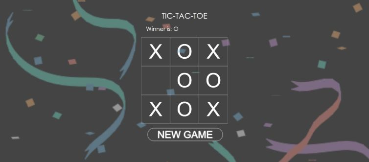

# **Tic-Tac-Toe-Game**
## Live preview: https://tic-tac-toe-f0f98.web.app/

This is a responsive tic-tac-toe game that I have developed using: \
⚡️ ReactJS, CSS, HTML. ⚡️ 



### Setup & Run
- Clone or download this repository https://github.com/sharonNissanov/Tic-Tac-Toe-Game
- Install dependencies: in cmd run ```npm install``` 
- Run the app in the development mode: in cmd run ```npm start```\
Open [http://localhost:3000](http://localhost:3000) to view it in the browser.\
The page will reload if you make edits.\
You will also see any lint errors in the console. 

Enjoy 😊